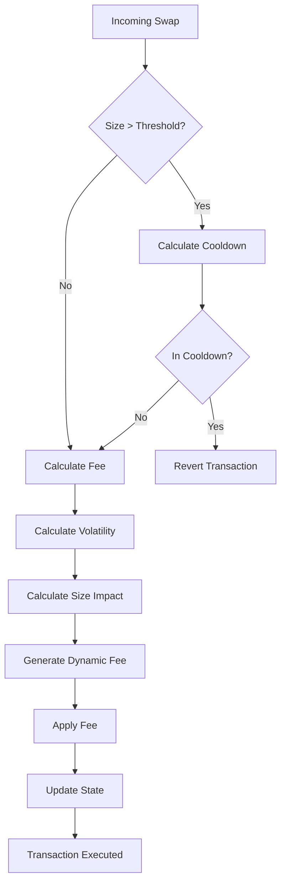

# 🛡️ Dex Mini MEV Protection Hook

[](LICENSE)
[](https://soliditylang.org)
[](http://makeapullrequest.com)
[](https://github.com/DexMini/Dex-Mini-MEV-Hook/wiki)

> *Advanced protection against MEV exploitation, front-running, and sandwich attacks with intelligent, dynamic fee adjustments*

<div align="center">
  
  
  
</div>

## 📖 Quick Navigation
<details>
<summary>Click to expand</summary>

- [🌟 Features](#-features)
- [🛡️ How It Works](#%EF%B8%8F-how-it-works)
- [🎯 User Experience](#-user-experience)
- [🏗️ Architecture](#%EF%B8%8F-architecture)
- [📦 Installation](#-installation)
- [🚀 Deployment](#-deployment)
- [🔧 Configuration](#-configuration)
- [📊 Performance](#-performance)
- [💰 Fee Structure](#-fee-structure)
- [👨‍💻 Example Scenarios](#-example-scenarios)
- [🛠️ Development](#%EF%B8%8F-development)
- [📜 License](#-license)

</details>

## 🌟 Features

### 🛡️ MEV Protection System
| Feature                | Description                                                                 |
|------------------------|-----------------------------------------------------------------------------|
| Adaptive Fee Engine    | 📈 Real-time fee adjustments based on market volatility and swap size       |
| Cooldown Mechanism     | ⏳ Configurable time-lock between fee updates (30s default + dynamic)       |
| Volatility Oracle      | 📊 EMA-based price movement tracking (9-period exponential smoothing)       |
| Swap Size Analyzer     | 🔍 EMA-based analysis of transaction sizes                                  |
| MEV Capture            | 💸 Converts potential MEV into fees for LPs instead of attackers            |

### 🚀 Key Advantages
- ⚡ Fully compatible with Uniswap V4 hook architecture
- 🔒 Non-custodial design with no admin privileges
- 📉 Progressive fee scaling from 0.05% to 1.0%
- 🛡️ Front-running protection through dynamic pricing
- 🧮 Intelligent cooldown periods based on market volatility
- 💰 Increased yield for liquidity providers in volatile markets

## 🛡️ How It Works

### Understanding MEV Risks

<div align="center">
  
</div>

#### What is MEV?
Miner Extractable Value (MEV) is the profit miners/validators make by reordering, censoring, or inserting transactions. Over $1.43 billion has been extracted from Ethereum users through MEV strategies.

#### Common Attack Vectors
- **Front-Running**: Attackers detect pending transactions and execute them first by paying higher gas fees
- **Sandwich Attacks**: Malicious actors place transactions before and after user trades to manipulate price and profit
- **Arbitrage Extraction**: Bots exploit temporary price inconsistencies across markets

### Our Defense Mechanisms

<div align="center">



</div>

1. **Adaptive Fee Mechanism**
   - Detects market volatility using exponential moving averages
   - Analyzes transaction size relative to liquidity
   - Dynamically adjusts fees between 0.05% and 1.0%

2. **Adaptive Cooldown Enforcement**
   - Base cooldown of 30 seconds between large swaps
   - Extended cooldown periods during high volatility
   - Multiple blocks required between high-value transactions

3. **State Tracking**
   - Monitors price movements via tick changes
   - Records transaction volumes and trends
   - Maintains timestamp/block data for timely cooldown enforcement

## 🎯 User Experience

### For Liquidity Providers
1. **Pool Creation & Integration**
   ```mermaid
   graph LR
       A[Create Pool] --> B[Enable Hook]
       B --> C[Initial Liquidity]
       C --> D[Monitor Metrics]
   ```
   - Deploy pool with MEV Protection enabled
   - Add initial liquidity
   - Monitor fee generation and pool metrics

2. **Benefits**
   - 💰 Higher fee capture during volatile periods
   - 🛡️ Protection against sandwich attacks
   - 📊 Transparent fee adjustment mechanism
   - 📈 Reduced impermanent loss from MEV-induced volatility

### For Traders
1. **Trading Experience**
   ```mermaid
   graph LR
       A[Submit Trade] --> B[Hook Checks]
       B --> C[Fee Calculation]
       C --> D[Execute Trade]
   ```
   - Submit swap through standard Uniswap interface
   - Hook automatically calculates optimal fee
   - Trade executes with MEV protection

2. **Advantages**
   - ⚡ Fast execution during normal conditions
   - 💸 Fair pricing based on market conditions
   - 🔒 Protection against front-running
   - 🛑 Elimination of sandwich attacks

### Real-World Example
```solidity
// Example of a protected swap
function swapExactInputSingle(
    address tokenIn,
    address tokenOut,
    uint24 poolFee,
    uint256 amountIn
) external returns (uint256 amountOut) {
    // Hook automatically adjusts fee based on:
    // 1. Current market volatility
    // 2. Swap size relative to pool
    // 3. Recent trading activity
}
```

## 🏗️ Architecture

### Core Components
1. **Fee State Manager**  
   ```solidity
   struct FeeState {
       int24 currentTick;         // Current pool tick
       uint64 lastUpdatedTimestamp; // Last update timestamp
       uint64 lastUpdatedBlock;     // Last update block number
       uint256 volatilityEMA;     // Price volatility EMA
       uint256 swapSizeEMA;       // Order size EMA
   }
   ```

2. **Key Constants**
   | Parameter | Value | Purpose |
   |-----------|-------|---------|
   | BASE_MEV_COOLDOWN_TIME | 30 seconds | Sets minimum delay between swaps |
   | BASE_MEV_COOLDOWN_BLOCKS | 2 blocks | Block-based backup cooldown |
   | MIN_FEE | 500 (0.05%) | Baseline fee for all swaps |
   | MAX_FEE | 10000 (1.0%) | Maximum fee cap |
   | FEE_CAPTURE_RATE | 6500 (65%) | MEV opportunity conversion rate |
   | FEE_SCALING_FACTOR | 1e18 | Precision for calculations |
   | SMALL_SWAP_THRESHOLD | 1e18 | Threshold for cooldown exemption |

3. **Protection Mechanism Flow**
   ```mermaid
   graph TD
       A[Incoming Swap] --> B{Check Cooldown}
       B -->|Active| C[Use Current Fee]
       B -->|Inactive| D[Calculate New Fee]
       D --> E[Update State]
       E --> F[Apply Fee]
   ```

## 📦 Installation
```bash
# Clone repository
git clone https://github.com/DexMini/Dex-Mini-MEV-Hook.git
cd Dex-Mini-MEV-Hook

# Install dependencies
forge install

# Build contracts
forge build
```

## 🚀 Deployment

### Prerequisites
- Ethereum RPC endpoint
- Deployer account with ETH
- Pool Manager contract address

### Steps
1. **Deploy Contract**
   ```bash
   forge create --rpc-url <RPC_ENDPOINT> \
       --constructor-args <POOL_MANAGER_ADDRESS> \
       --private-key <DEPLOYER_KEY> \
       src/DexminiMEVHook.sol:DexminiMEVHook
   ```

2. **Verify Contract**
   ```bash
   forge verify-contract --chain-id 1 \
       <DEPLOYED_ADDRESS> \
       src/DexminiMEVHook.sol:DexminiMEVHook
   ```

3. **Create Protected Pool**
   ```solidity
   // JavaScript/TypeScript example using ethers.js
   const factory = new ethers.Contract(FACTORY_ADDRESS, FACTORY_ABI, signer);
   await factory.createPool({
     tokenA: TOKEN_A_ADDRESS,
     tokenB: TOKEN_B_ADDRESS,
     fee: 3000, // 0.3% base fee
     tickSpacing: 60,
     hooks: MEV_HOOK_ADDRESS,
     initialSqrtPrice: SQRT_PRICE
   });
   ```

## 🔧 Configuration

### Customizable Parameters
| Parameter | Default | Adjustable Range | Notes |
|-----------|---------|------------------|-------|
| Cooldown Time | 30 seconds | 0-300 seconds | Zero disables cooldown |
| Cooldown Blocks | 2 blocks | 0-20 blocks | Block-based backup |
| Min Fee | 0.05% | 0.01%-0.5% | Minimum fee charged |
| Max Fee | 1.0% | 0.1%-5.0% | Fee ceiling |
| Fee Capture | 65% | 10%-90% | % of MEV to capture |
| Small Swap | 1 token | 0.1-100 tokens | Cooldown exemption |

## 📊 Performance

### Metrics & Benchmarks
| Parameter               | Value       | Impact                              |
|------------------------|-------------|-------------------------------------|
| Base Cooldown          | 30 seconds  | Prevents fee manipulation           |
| Volatility Window      | 9 periods   | Balanced market responsiveness      |
| Min Fee               | 0.05%       | Ensures minimum protocol revenue    |
| Max Fee               | 1.00%       | Caps trader costs                   |
| Fee Capture Rate      | 65%         | Optimal MEV prevention              |

### Gas Optimization
- Efficient storage packing
- Minimal state updates
- Optimized math operations using unchecked blocks
- EMA calculations with bit shifts where possible

## 💰 Fee Structure

### 1. Fee Overview
Dex Mini employs a modular fee model designed to align costs with services utilized, ensuring sustainability while maximizing value.

### 2. Fee Breakdown

#### 2.1 Liquidity Management Fees
- **Action:** Adding, removing, or adjusting liquidity positions.
- **Fee:** 0.25% flat fee per transaction, allocated as follows:
   - **30% → Eigenlayer Operator:** Safeguards users and pools against risks.
   - **70% → Dex Mini Protocol:** Supports platform development and operations.

#### 2.2 Trading Fees
- **Structure:**
   - **90% → Liquidity Providers (LPs):** Directly rewards LPs.
   - **10% → Dex Mini Protocol:** Funds MEV protection mechanisms.
- **Dynamic Component:** Fees fluctuate based on:
   - Current market volatility (tick changes)
   - Swap size relative to liquidity
   - Recent trading history

### 3. Key Features
- **Dynamic Adjustments:** Fees adapt to asset risk profiles and market conditions.
- **Transparency:** All fee allocations are publicly verifiable on-chain.

## 👨‍💻 Example Scenarios

### 1. Regular User Swap (Alice)
<details>
<summary>Alice swaps 1.5 ETH for USDC</summary>

1. **Alice initiates swap** with 1.5 ETH
2. **Hook determines:**
   - Swap exceeds threshold (1.5e18 > 1e18)
   - No cooldown is active
3. **Dynamic fee calculated:**
   - Current volatility is moderate
   - Fee set to 0.085% (up from base 0.05%)
4. **Transaction completes**
   - Alice receives USDC with MEV protection
   - Pool enters cooldown for subsequent large swaps
</details>

### 2. Liquidity Provider (Bob)
<details>
<summary>Bob adds liquidity to ETH/USDC pool</summary>

1. **Bob adds liquidity** (10 ETH + USDC)
2. **Hook is bypassed** for liquidity operations
3. **Long-term impact:**
   - Higher fees during volatility (up to 70% increase)
   - Protection against front-running
   - Reduced impermanent loss from toxic flow
</details>

### 3. Attempted MEV Attack (Charlie)
<details>
<summary>Charlie tries to execute arbitrage</summary>

1. **First attempt** with 50 ETH swap
   - Large swap triggers 45s cooldown check
   - **Reverts** with "MEV cooldown active"
2. **After waiting** full cooldown period
   - High volatility triggers 0.92% fee
   - Profit margin significantly reduced
   - New cooldown period enforced
</details>

## 🛠️ Development

### Local Testing
```bash
# Run all tests
forge test -vvv

# Run specific test
forge test --match-test testDynamicFeeAdjustment -vvv

# Generate coverage
forge coverage --report lcov
```

### Code Style
```bash
# Format code
forge fmt

# Check linting
forge lint
```

## 📜 License
This project is licensed under the **MIT License** - see the [LICENSE](LICENSE) file for details.

---

<div align="center">

**Built with 💜 for the DeFi Community**

[Documentation](https://github.com/DexMini/Dex-Mini-MEV-Hook/wiki) | 
[Report Bug](https://github.com/DexMini/Dex-Mini-MEV-Hook/issues) | 
[Request Feature](https://github.com/DexMini/Dex-Mini-MEV-Hook/issues)

</div>
