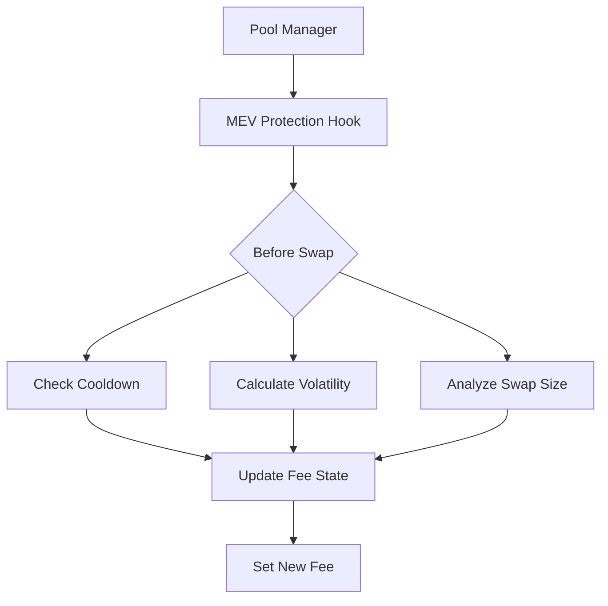

# 🛡️ MEV Protection Hook | Uniswap V4 Dynamic Fee Module

[](LICENSE)
[](https://soliditylang.org)
[](https://github.com/DexMini/Dex-Mini-MEV-Hook/actions)

<div align="center">
  
</div>

## 📖 Table of Contents
- [✨ Features](#-features)
- [🏗️ Architecture](#%EF%B8%8F-architecture)
- [📦 Installation](#-installation)
- [🚀 Deployment](#-deployment)
- [🔧 Configuration](#-configuration)
- [📈 Performance Metrics](#-performance-metrics)
- [🛠️ Development](#%EF%B8%8F-development)
- [📜 License](#-license)

## ✨ Features
### 🛡️ MEV Protection System
| Feature                | Description                                                                 |
|------------------------|-----------------------------------------------------------------------------|
| Adaptive Fee Engine    | 📈 Real-time fee adjustments based on market volatility and swap size       |
| Cooldown Mechanism      | ⏳ Configurable time-lock between fee updates (30s default)                |
| Volatility Oracle       | 📊 EMA-based price movement tracking (9-period exponential smoothing)     |
| Swap Size Analyzer      | 🔍 EMA-based analysis of transaction sizes                                  |

### 🚀 Key Advantages
- ⚡ Fully compatible with Uniswap V4 hook architecture
- 🔒 Non-custodial design with no admin privileges
- 📉 Progressive fee scaling from 0.05% to 1.0%
- 🛡️ Front-running protection through dynamic pricing

## 🏗️ Architecture



### Core Components
1. **Fee State Manager**  
   `struct FeeState` tracking:
   - `currentTick`: Current pool price tick
   - `volatilityEMA`: 9-period EMA of price changes
   - `swapSizeEMA`: 9-period EMA of swap values
   - `lastUpdated`: Timestamp of last update

2. **Dynamic Fee Calculator**  
   ```solidity
   function calculateFee(uint256 volatility, uint256 swapSize) 
       internal pure returns (uint24) {
       uint256 rawFee = MIN_FEE + (volatility * swapSize * FEE_RATE) / SCALER;
       return uint24(rawFee > MAX_FEE ? MAX_FEE : rawFee);
   }
   ```

## 📦 Installation
```bash
# Clone repository
git clone https://github.com/DexMini/Dex-Mini-MEV-Hook.git
cd Dex-Mini-MEV-Hook

# Install dependencies
forge install

# Build contracts
forge build
```

## 🚀 Deployment
```bash
forge create --rpc-url <RPC_ENDPOINT> \
    --constructor-args <POOL_MANAGER_ADDRESS> \
    --private-key <DEPLOYER_KEY> \
    src/MEVProtectionHook.sol:MEVProtectionHook
```

## 🔧 Configuration
```solidity
// foundry.toml
[profile.default]
src = "src"
out = "out"
libs = ["lib"]
remappings = [
    "@uniswap/v4-core/=lib/v4-core",
    "@uniswap/v4-periphery/=lib/v4-periphery",
    "solmate/=lib/solmate/src/"
]

[fmt]
line_length = 100
tab_width = 4
```

## 📈 Performance Metrics
| Parameter               | Value       | Description                          |
|-------------------------|-------------|--------------------------------------|
| Base Cooldown           | 30 seconds  | Minimum time between fee updates     |
| Volatility Window       | 9 periods   | EMA calculation window               |
| Min Fee                 | 0.05%       | Floor rate for swaps                 |
| Max Fee                 | 1.00%       | Ceiling rate for swaps               |
| Fee Capture Rate        | 65%         | MEV profit conversion ratio          |

## 🛠️ Development
```bash
# Run tests
forge test -vvv

# Generate coverage report
forge coverage --report lcov

# Format code
forge fmt
```

## 📜 License
This project is licensed under the **MIT License** - see the [LICENSE](LICENSE) file for details.
